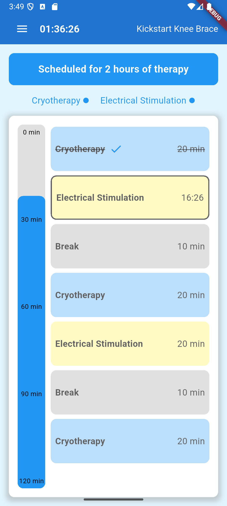

# Kickstart Knee Brace App

A Flutter app for managing therapy sessions, including Cryotherapy and Electrical Stimulation. Users can set therapy duration, choose therapies, and view a personalized therapy schedule.

## Features
- Set therapy duration (hours and minutes).
- Choose between Cryotherapy and Electrical Stimulation.
- View a personalized therapy schedule.
- Track the status of your therapy session in real-time.
- Navigate between Home, Status, Schedule, and Help screens.

## Screenshots
| Home Screen | Status Screen | Schedule Screen |
|-------------|---------------|-----------------|
|  |  |  |

## Getting Started

### Prerequisites
- Flutter SDK: Make sure you have Flutter installed. If not, follow the [official Flutter installation guide](https://flutter.dev/docs/get-started/install).
- Git: Ensure Git is installed on your system.

### Installation
1. Clone the repository:
   ```bash
   git clone https://github.com/your-username/kickstart-knee-brace.git
   
2. Navigate to the project directory:
   ```bash
    cd kickstart-knee-brace
   
3. Install dependencies:
   ```bash
    flutter pub get
   
4. Connect a device or start an emulator.

5. Run the app:
   ```bash
    flutter run

### Dependencies
provider: For state management.

flutter_local_notifications: For local notifications (if applicable).

sqflite: For local storage (if applicable).

## Folder Structure
Kickstart/

├── android/ # Android-specific files

├── assets/ # App assets

│ └── icon/ # App icon

├── ios/ # iOS-specific files

├── lib/ # Dart code

│ ├── main.dart # Entry point of the app

│ ├── therapy_schedule_screen.dart

│ ├── status_page.dart

│ ├── schedule_page.dart

│ └── help_page.dart

├── linux/ # Linux-specific files

├── macos/ # macOS-specific files

├── test/ # Unit and widget tests

├── web/ # Web-specific files

├── windows/ # Windows-specific files

├── analysis_options.yaml # Dart static analysis configuration

├── pubspec.yaml # App dependencies and metadata

└── README.md # Project documentation

## Contributing
Contributions are welcome! If you'd like to contribute, please follow these steps:

Fork the repository.

Create a new branch (git checkout -b feature/YourFeatureName).

Commit your changes (git commit -m 'Add some feature').

Push to the branch (git push origin feature/YourFeatureName).

Open a pull request.

## License
This project is licensed under the MIT License.

## Acknowledgments

Flutter Documentation: For Flutter resources and guides.

Provider Package: For state management.

Icons8: For app icons (if applicable).

## Contact
If you have any questions or feedback, feel free to reach out:

Landon Wellendorf

Email: landon.w10@hotmail.com

GitHub: landonw10


